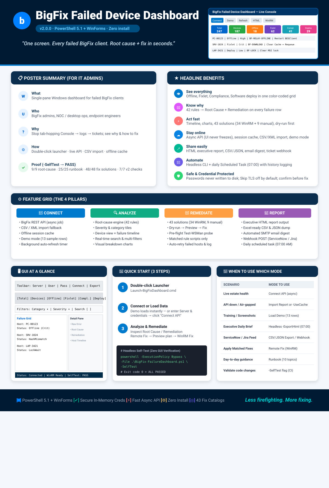

# BigFix Failed Device Dashboard

**v2.0.0 · PowerShell 5.1 + WinForms · Zero install**

> **One screen. Every failed BigFix client. Root cause + fix in seconds.**



---

## Poster summary (for IT admins)

| | |
|--|--|
| **What** | Single-pane Windows dashboard for failed BigFix clients |
| **Who** | BigFix admins, NOC / desktop ops, endpoint engineers |
| **Why** | Stop tab-hopping Console → logs → tickets; see *why* it failed and *how* to fix it |
| **How** | Double-click launcher · live API · CSV import · offline cache · scheduled HTML report |
| **Proof** | `-SelfTest` → **PASS** (9/9 root-cause · 25/25 runbook · 48/48 fix solutions · 7/7 v2 checks) |

### Headline benefits

- **See everything** — Offline, Fixlet, Compliance, Software deploy in one color-coded grid  
- **Know why** — 42 rules → Root Cause + Remediation on every row  
- **Act fast** — Device timeline, charts, 43-solution catalog (34 WinRM + 9 manual), dry-run first  
- **Stay online** — Async API (UI never freezes), session cache, CSV/XML import, demo mode  
- **Share easily** — HTML executive report, CSV/JSON, email digest, ticket webhook  
- **Automate** — Headless CLI + daily Scheduled Task (07:00) with history CSV/JSON  
- **Safe** — Passwords never written to disk; Skip TLS off by default; confirm before remote fix  

### Feature grid (poster blocks)

| **Connect** | **Analyze** | **Remediate** | **Report** |
|-------------|-------------|---------------|------------|
| BigFix REST API (background job) | Root-cause engine (42 rules) | Remote Fix (43 solutions / 4 defaults) | HTML / CSV / JSON export |
| CSV / XML import | Severity + category tiles | Dry-run → Preview → Fix | Email digest (SMTP) |
| Demo data | Device view + timeline | Rule-matched scripts only | Ticket webhook (JSON POST) |
| Session cache (offline) | Search / filter | Healthy rows skipped | Tray critical alerts |
| Auto-refresh timer | Charts (4 visuals) | Log + run-history CSV | Daily scheduled report |

### GUI at a glance

```
┌ Toolbar: Server | User | Pass | Offline hrs | Skip TLS | Auto-refresh ─┐
│ [Connect] [Import] [Demo] [Refresh] [CSV] [HTML] [Email] [Ticket]     │
│ [Runbook] [Settings] [About]                                          │
├ Tiles: Total | Devices | Offline | Fixlet | Compliance | Software … ───┤
├ Filters: Category | Severity | Search | [Device view] | Clear ────────┤
│ Tabs: [Dashboard]  [Charts]  [Remote Fix]                             │
│   Grid  ──►  Detail: Raw error · Root cause · Remediation · Timeline  │
└ Status bar ───────────────────────────────────────────────────────────┘
```

### Quick start (3 steps)

1. Double-click **`Launch-BigFixDashboard.cmd`**  
2. Demo loads — or enter Server / User / Password → **Connect API**  
3. Click a row → **Root Cause** / **Remediation** → filter, export, or **Remote Fix**

**Self-test:** `powershell -File .\BigFix-FailureDashboard.ps1 -SelfTest` → exit `0`

### When to use which mode

| Scenario | Mode |
|----------|------|
| Live estate health | Connect API (async) |
| API down / firewall | Import Report or `-UseCache` |
| Training / screenshots | Load Demo |
| Daily HTML for leadership | Headless `-ExportHtml` + scheduled task |
| Ticket / ServiceNow feed | CSV/JSON export or webhook |
| Apply matched fixes | Remote Fix → scope + severity → Test WinRM → Preview → Fix |
| Day-to-day ops guidance | Runbook (10 topics) |

---

## Contents

- [Poster summary (for IT admins)](#poster-summary-for-it-admins)
- [Features at a glance](#features-at-a-glance)
- [Files](#files)
- [Quick start](#quick-start)
- [Headless / scheduled use](#headless--scheduled-use)
- [How it works](#how-it-works)
- [Deployment & server load](#deployment--server-load)
- [GUI layout](#gui-layout)
- [Remote Fix (WinRM)](#remote-fix-winrm)
- [Remote fix catalog](#remote-fix-catalog)
- [Root-cause rules](#root-cause-rules)
- [Runbook](#runbook)
- [Self-test](#self-test)
- [Extending the tool](#extending-the-tool)
- [Security notes](#security-notes)
- [Limitations](#limitations)
- [Troubleshooting](#troubleshooting)
- [Crash fixes (v2.0.0)](#crash-fixes-v200)

---

## Features at a glance

| Area | What you get |
|------|----------------|
| **Data sources** | BigFix REST API (async background job), CSV/XML import, demo, session cache |
| **Categories** | Offline, FixletFailure, ComplianceFailure, SoftwareDeployment, Healthy |
| **Analysis** | 42 regex rules → Root Cause + Remediation + MatchedRule per row |
| **UI** | Summary tiles, filters/search, color-coded grid, detail pane, status bar |
| **Tabs** | **Dashboard**, **Charts**, **Remote Fix** (last tab) |
| **Device view** | Collapse failures per device with timeline / health summary |
| **Charts** | Category / severity / top devices / top rules (DataVisualization, guarded) |
| **Remote Fix** | 43 solutions (34 WinRM + 9 manual) + 4 category defaults; dry-run; confirm; `Invoke-Command` per host |
| **Runbook** | 10 day-to-day topics with search/export |
| **Export** | Filtered CSV, **HTML executive report**, **JSON** (Excel-friendly CSV) |
| **Delivery** | Email digest (SMTP), ticket webhook (JSON POST), tray balloon alerts |
| **Refresh** | Auto-refresh timer (minutes) + manual Refresh; background API job |
| **Persistence** | `settings.json` (no passwords), `cache\last-pull.json` offline fallback |
| **Headless** | `-ExportHtml/-ExportCsv/-ExportJson/-Email/-UseCache/-ImportPath` |
| **SelfTest** | Headless CI checks (analysis + runbook + fixes + v2 export/cache/settings) |
| **Zero install** | Pure PowerShell + WinForms; zip the folder and share |

---

## Files

```
BigFix-FailureDashboard\
├── BigFix-FailureDashboard.ps1   Main script (GUI + API + analysis + Remote Fix + headless)
├── Launch-BigFixDashboard.cmd    Double-click launcher (hidden console + STA)
├── README.md                     This document
├── TOOL-EXPLANATION.txt          Longer operator documentation
├── settings.json                 Created at runtime (server, SMTP, thresholds — no passwords)
├── cache\last-pull.json          Created on successful API pull (offline fallback)
├── reports\                      Daily scheduled-task outputs (HTML + history CSV/JSON + log)
│   ├── Run-DailyReport.ps1       Wrapper used by scheduled task
│   ├── bf-report-YYYYMMDD.html
│   ├── history\bf-report-*.csv|json
│   └── last-run.log
├── BigFix_Failure_Dashboard_…pptx  Feature / admin-benefits deck (21 slides)
└── sample-data\
    └── sample-failures.csv       Sample import for offline testing
```

---

## Quick start

1. Double-click **`Launch-BigFixDashboard.cmd`** (or run the `.ps1` with `-STA`).
2. Demo data auto-loads so the UI works immediately.
3. Click a row → read **Root Cause** / **Remediation** in the detail pane.
4. Filter **Category** or search a hostname; toggle **Device view** to group by device.
5. For live data: enter Server / User / Password → **Connect API** (background job — UI stays responsive).
6. If the API is down: **Import Report…** or **Refresh** against **session cache**.
7. **Export CSV…**, **HTML…** (executive report), or **JSON…**.
8. Optional: **Email…**, **Ticket…** (webhook), **Settings…** (SMTP/URL/auto-refresh).
9. **Runbook** for searchable troubleshooting topics.
10. Open the **Charts** tab; open the last tab **Remote Fix** → **Test WinRM** (optional) → **Preview plan** → **Fix (WinRM)**.

**Self-test (no GUI):**

```powershell
powershell -NoProfile -ExecutionPolicy Bypass -File .\BigFix-FailureDashboard.ps1 -SelfTest
```

Exit code `0` = pass, `1` = fail.

---

## Headless / scheduled use

No GUI — same script, command-line parameters:

```powershell
# HTML + CSV + JSON from cache (no password)
powershell -NoProfile -ExecutionPolicy Bypass -File .\BigFix-FailureDashboard.ps1 `
  -ExportHtml C:\Reports\bf.html -ExportCsv C:\Reports\bf.csv -ExportJson C:\Reports\bf.json -UseCache

# Email digest (SMTP settings in settings.json; password via $env:BIGFIX_SMTP_PASSWORD)
powershell ... -Email -UseCache

# Import a CSV then export HTML
powershell ... -ImportPath .\sample-data\sample-failures.csv -ExportHtml C:\Reports\bf.html
```

**Scheduled task example (daily 07:00):**

```powershell
$action  = New-ScheduledTaskAction -Execute 'powershell.exe' `
  -Argument '-NoProfile -ExecutionPolicy Bypass -File "C:\Users\SAM\BigFix-FailureDashboard\BigFix-FailureDashboard.ps1" -ExportHtml C:\Reports\bf.html -UseCache'
$trigger = New-ScheduledTaskTrigger -Daily -At 7:00am
Register-ScheduledTask -TaskName 'BigFix Dashboard Report' -Action $action -Trigger $trigger
```

**Installed on this machine:** task **`BigFix Dashboard Daily Report`** (daily 07:00) runs `reports\Run-DailyReport.ps1`, which prefers `cache\last-pull.json` (`-UseCache`) and falls back to `sample-data\sample-failures.csv` (`-ImportPath`). Outputs:

| Path | Content |
|------|---------|
| `reports\bf-report-YYYYMMDD.html` | Executive HTML |
| `reports\history\bf-report-YYYYMMDD.csv` | CSV |
| `reports\history\bf-report-YYYYMMDD.json` | JSON |
| `reports\last-run.log` | Last run exit code + console |

Dry-run verified: wrapper exit `0`, HTML written. After a real API pull, the task auto-switches to cache.

| Parameter | Purpose |
|-----------|---------|
| `-ExportHtml path` | Write HTML report then exit |
| `-ExportCsv path` | Write sorted CSV then exit |
| `-ExportJson path` | Write JSON then exit |
| `-Email` | Send digest (needs SMTP in settings) |
| `-ImportPath file` | Load CSV/XML instead of demo/API |
| `-UseCache` | Prefer `cache\last-pull.json` (offline) |
| `-Password` / `$env:BIGFIX_DASH_PASSWORD` | API password for headless pulls |
| `-ApiWorker cfg` | Internal: background API child process |
| `-SelfTest` | CI checks, exit 0/1 |

**Headless smoke (this machine):** `-ImportPath sample-failures.csv -ExportHtml/-ExportCsv/-ExportJson` → exit `0`, HTML/CSV/JSON written.

**Live API smoke:** not run here — no BigFix service on `localhost:52311` and no `BIGFIX_DASH_PASSWORD`. Against a real server: set `-Server` / `-Username` and `$env:BIGFIX_DASH_PASSWORD`, or use GUI **Connect API** once to populate cache.

---

## How it works

### 1. Startup

1. Launcher starts PowerShell with `-WindowStyle Hidden`.
2. Script ensures **STA** (WinForms); re-launches itself if needed (skipped for exports/`-ApiWorker`).
3. Loads `settings.json` (non-secret prefs).
4. Builds UI: toolbar → tiles → filter bar → tabs (Dashboard, Charts, Remote Fix).
5. Auto-loads demo (or session cache with `-UseCache`).

### 2. Data sources

**Mode A — BigFix REST API (async)**  
- Two-phase job: inventory first (grid paints quickly), then failure scan reuses auth.  
- Runs in a **background job** child process (`-ApiWorker`) writing `progress.txt` / `result.json`; UI timer polls without freezing.  
- Parallel relevance queries (runspace pool) + transient retry/backoff.  
- On success: writes **session cache** for offline fallback.  
- Optional **Skip TLS cert check**. Offline threshold default **4h**.

**Mode B — Import Report** — flexible CSV/XML aliases.

**Mode C — Demo / Cache** — 13 rows / 9 devices, or last successful pull.

**Refresh / Auto-refresh** — re-runs last source or cache; timer in minutes (Settings / toolbar).

### 3. Failure categories

| Category | Meaning |
|----------|---------|
| `Offline` | Not reporting within threshold |
| `FixletFailure` | Fixlet/action failed |
| `ComplianceFailure` | Baseline / policy failed |
| `SoftwareDeployment` | Patch or app deployment failed |
| `Healthy` | Reporting OK within threshold |

### 4. Root-cause engine

`New-FailureRecord` → `Get-FailureAnalysis`: regex against `$script:RootCauseRules` (**42 rules**, including BF-PROXY, BF-CERT, BF-FIREWALL, BF-LOW-MEMORY, BF-PENDING-REBOOT, BF-GPO, BF-VPN, BF-DISK-IO, BF-SCCM-CONFLICT, BF-WMI, BF-ACCOUNT-LOCKED, BF-UAC, BF-TIMESYNC, …). Stores **RootCause**, **Remediation**, **MatchedRule** for Remote Fix. Full solution list: [Remote fix catalog](#remote-fix-catalog).

### 5. Settings, cache, alerts

- **settings.json** — server URL, user, offline hours, auto-refresh minutes, SMTP, ticket webhook, export dir, device-view flag. **Passwords never written.**
- **cache\last-pull.json** — last successful API payload for `-UseCache` / offline refresh.
- **Critical alerts** — when critical count rises, optional tray balloon (NotifyIcon) + status text.

---

## Deployment & server load

**Runs anywhere** — Console workstation, admin laptop, NOC desktop, or the root server itself. Nothing from the BigFix Console is read or modified; requirements are Windows PowerShell 5.1, reachability to **TCP 52311**, and an operator with **Can use REST API**.

**Load per full pull (Connect API / Refresh)** — read-only, ~6–8 HTTP GETs:

| Step | Requests | Root-server cost |
|------|----------|------------------|
| `GET /api/help`, `/api/computers`, `/api/actions` + hostname query | 4 | Light — inventory/action XML build + DB read |
| Failed-fixlet + compliance relevance scans (parallel) | 2 | **Main CPU cost** — session relevance over computers × failed actions |
| Fallbacks / retries | ≤2 per query (backoff 1s/2s on transient 5xx/timeout); ≤3 auth probes on 401 | Bounded worst case |
| Concurrency | Max **3** parallel queries (runspace pool) | Cannot flood the server |

- **Strictly read-only** — GET only; no writes, no DB locks, no client push.
- **CPU** scales with estate size (computers × failed actions); **memory** is transient MB-scale response buffering — same profile as one Console operator query, then idle.
- **Zero server load:** demo, CSV/XML import, cache refresh, exports, and the scheduled `-UseCache` report. **Remote Fix / Test WinRM** talk to endpoints directly (5985/5986), bypassing the root server entirely.
- **Guidance:** auto-refresh ≥ 10–15 min on large estates (default `0` = off); one instance per shift rather than per operator.

---

## GUI layout

```
┌─ Toolbar: Server | User | Pass | Offline hrs | Skip TLS | Auto-refresh ───┐
│  [Connect] [Import] [Demo] [Refresh] [Export CSV] [HTML] [Email] [Ticket] │
│  [Runbook] [Settings] [About]                                             │
├─ Tiles: Total | Devices | Offline | Fixlet | Compliance | Software | … ──┤
├─ Filters: Category | Severity | Search | [Device view] | Clear ──────────┤
├─ Tabs ───────────────────────────────────────────────────────────────────┤
│  [Dashboard]  [Charts]  [Remote Fix]                                     │
│  ┌ grid ────────────────┬ detail (raw / root cause / remediation / time) ┐│
│  └──────────────────────┴───────────────────────────────────────────────┘│
└─ Status bar ─────────────────────────────────────────────────────────────┘
```

- **Dashboard** — grid + detail; device view groups by device with timeline.  
- **Charts** — 4 charts (category, severity, top devices, top rules); graceful label fallback if assembly missing.  
- **Remote Fix** — last tab: scope + severity, credentials, timeout, dry-run, Test WinRM, Preview, **Fix (WinRM)**, Retry failed, Export log, Stop, live log.

---

## Remote Fix (WinRM)

**Workflow:** scope (Selected / Filtered / All failed) + severity → optional **Test WinRM** pre-flight → **Preview plan** → **Fix (WinRM)** (confirm / dry-run) → log → **Retry failed** if needed.

Same scoped behavior as v1: only solutions matching each row’s `MatchedRule` (or category default); Healthy skipped; dry-run / confirm; per-host `Invoke-Command`. Scope: Selected / Filtered / All failed (device view expands selected device’s failures).

| Control | Purpose |
|---------|---------|
| **Severity** (All / Critical only / Critical + High) | Shrink the plan before execute |
| **Timeout** (sec) | WinRM open/operation timeout per host |
| **Test WinRM** | `Test-WSMan` every remotable host in scope; OK/Fail counts in status bar |
| **Preview plan** | Color-coded plan: `[WINRM]` / `[MANUAL]` / `[SKIP]` + severity counts |
| **Fix (WinRM)** | Confirm dialog with preview + timeout; dry-run option |
| **Retry failed** | Rebuild plan from last run; only `Failed` / `WinRM-Failed` |
| **Export log** | Save the Remote Fix log to `.txt` |
| **Stop** | Cooperative cancel after the current host |
| **Run history** | Auto CSV: `reports\history\fix-run-yyyyMMdd-HHmmss.csv` |

Each execute logs per-host progress `[n/N] Connecting WinRM -> host`, duration `(12.3s)`, then a summary `OK= / Failed= / Manual= / Skip=`. Tip line points at **Retry failed** when failures remain.

Lab option: **Treat demo hosts as localhost**. Credentials: current Windows account, or explicit user/password (never written to `settings.json`).

| Status | Meaning |
|--------|---------|
| `OK` / `Failed` / `WinRM-Failed` / `Manual` / `WhatIf` / `Skipped` | As before (`Skipped` also used for stop-before-host) |

Full solution list: [Remote fix catalog](#remote-fix-catalog).

---

## Remote fix catalog

All solutions live in `$script:FixSolutions` (keyed by rule Id). Healthy rows are always skipped. Each failed row picks a solution by `MatchedRule`, or the category default if no rule matched.

### Auto / WinRM (remote script via `Invoke-Command`)

| Id | Fix title |
|----|-----------|
| `BF-DOWNLOAD` | Restart BESClient + clear pending download cache |
| `BF-DL-FAILED` | Restart BESClient + requeue failed downloads |
| `BF-HASH-MISMATCH` | Flush BES cache and restart client (hash mismatch) |
| `BF-RELAY-OFFLINE` | Offline recovery: service, logs, TCP 52311, DNS, cache reset |
| `BF-NET-PORT` | Test TCP 52311 connectivity to BigFix relay/root |
| `BF-DNS-RELAY` | Resolve relay hostname (DNS) from client settings |
| `BF-CACHE-CORRUPT` | Reset client cache: stop BESClient, delete `__BESData`, restart |
| `BF-DISK` | Free disk space (Temp + BES download folders) |
| `BF-ACCESS` | Collect access-denied diagnostics (ACLs + event log) |
| `BF-INSTALL-EXIT` | Check reboot-pending state after MSI failure |
| `BF-SERVICE` | Restart failed Windows service related to action |
| `BF-LOCK` | Clear stuck MSI / installation lock |
| `BF-ACTION-WAITING` | Restart BESClient to clear stuck Waiting/Locked action |
| `BF-ONE-ACTION` | Restart BESClient to clear stuck Running action |
| `BF-NOT-REPORTED` | Enable command polling + restart BESClient (ForceRefresh path) |
| `BF-GATHERHASH` | Enable command polling (UDP/52311 notifications blocked) |
| `BF-INSTALL-1920` | Fix BESClient service startup (1920/1923) |
| `BF-WINSOCK` | Reset Winsock + restart BESClient (relay registration) |
| `PATCH-FAIL` | Repair Windows Update stack (DISM + reset WU) |
| `APP-DEPLOY` | Application deploy diagnostics (space + installer processes) |
| `DEFENDER` | Microsoft Defender: update definitions |
| `BFI-UPLOAD` | Restart BESClient to requeue Inventory scan upload |
| `BF-ACCESS-DEFAULT` | Collect BESClient.log + daily `YYYYMMDD.log` failure tail |
| `BF-TIMESYNC` | Restart W32Time and force time resync |
| `BF-PROXY` | Inspect WinHTTP/system proxy settings |
| `BF-CERT` | Inspect TLS trust to relay/root (cert store + connectivity) |
| `BF-FIREWALL` | Report Windows Firewall profiles and BigFix-related rules |
| `BF-LOW-MEMORY` | Report top memory processes and free RAM |
| `BF-PENDING-REBOOT` | Detect pending reboot registry markers |
| `BF-GPO` | Force Group Policy refresh and read GPSvc errors |
| `BF-VPN` | Report network adapters and default route (VPN path check) |
| `BF-DISK-IO` | Report logical disk health indicators (free space + chkdsk flags) |
| `BF-SCCM-CONFLICT` | Report CCM/exec agent activity (management conflict check) |
| `BF-WMI` | Verify WMI repository (`winmgmt /verifyrepository`) |

### Manual (console / server only — listed as `Manual`, not run remotely)

| Id | Fix title |
|----|-----------|
| `BF-RELEVANCE` | Relevance error — fix in BigFix console |
| `COMP-BASELINE` | Compliance failure — remediate from BigFix console |
| `COMP-HARDENING` | Hardening drift — apply hardening fixlet |
| `BFI-UUID` | Duplicate UUID — fix in VM manager / Inventory |
| `BFI-SIGNATURE` | Software ID tag missing — catalog upload in Inventory |
| `BF-FILLDB` | FillDB / console stale — server-side action |
| `BF-CONSOLE-CACHE` | Clear local BigFix console cache (run on console host) |
| `BF-ACCOUNT-LOCKED` | Account lockout — manual identity remediation |
| `BF-UAC` | Elevation/UAC blocked action — adjust fixlet context |

### Category defaults (when no rule matches)

| Category | Default solution Id |
|----------|---------------------|
| `Offline` | `BF-RELAY-OFFLINE` |
| `FixletFailure` | `BF-ACCESS-DEFAULT` |
| `ComplianceFailure` | `COMP-BASELINE` |
| `SoftwareDeployment` | `APP-DEPLOY` |

**Counts:** 43 solutions total — **34** auto/WinRM (`Manual=$false`) + **9** manual (`Manual=$true`) — plus 4 category defaults. Validated by `-SelfTest` (fix-solution checks 48/48).

---

## Root-cause rules

Knowledge base: `$script:RootCauseRules` — each rule has `Id`, `Pattern`, `Category`, `Severity`, `RootCause`, `Remediation`. Add a matching `$script:FixSolutions[$Id]` entry for Remote Fix (see [Remote fix catalog](#remote-fix-catalog)). Coverage validated by `-SelfTest` (≥30 solutions, ≥35 rules).

---

## Runbook

Toolbar **Runbook** → 10 topics (offline, relay, console, Inventory, DB, maintenance, action status, slow clients, install errors, Web Reports) with search + export.

---

## Self-test

```text
Demo records : 13 across 9 devices
Sample CSV  : imported 13 rows OK
Root-cause checks: 9/9 passed
Runbook checks: 25/25 passed
Fix-solution checks: 48/48 passed
v2 feature checks: 7/7 passed
SELFTEST PASSED
```

v2 checks include HTML/CSV/JSON export smoke tests, device aggregates, cache round-trip, settings round-trip, and rule/solution minimums.

---

## Extending the tool

**New analysis rule** — append to `$script:RootCauseRules`; add `$script:FixSolutions` entry if remoted.

**New remote fix** — `$script:FixSolutions['MY-RULE'] = @{ Title=…; Manual=$false; Script='…' }` (see [Remote fix catalog](#remote-fix-catalog)).

**New runbook topic** — append to `$script:RunbookTopics`.

Re-run `-SelfTest` after edits.

---

## Security notes

- BigFix and WinRM passwords are **not written to disk** (memory only). SMTP password via env var only.  
- `settings.json` holds non-secret prefs only.  
- **Skip TLS cert check** is **off by default** (MITM risk if enabled).  
- REST calls do **not** follow HTTP redirects.  
- Offline recovery deletes `__BESData` only under the guarded BF-RELAY-OFFLINE sequence; `BF-CACHE-CORRUPT` always wipes (destructive).  
- Remote Fix requires WinRM rights; confirmation before non-dry-run.  
- Exported files may contain hostnames/IPs — treat as internal.  
- Launcher uses `-ExecutionPolicy Bypass`; prefer signing in locked-down environments.

---

## Limitations

- Windows-only GUI (WinForms / PS 5.1).  
- Relevance queries are version-dependent; import/cache cover gaps.  
- No per-action `/status` N+1 probes (too slow).  
- Manual rules still need BigFix console/server work.  
- WinRM must be allowed; offline devices show `WinRM-Failed`.  
- Chart tab needs `System.Windows.Forms.DataVisualization` (guarded fallback).  
- Headless email needs reachable SMTP + settings.

---

## Troubleshooting

| Symptom | What to try |
|---------|-------------|
| Cannot reach BigFix API | URL/port 52311, VPN, Skip TLS, operator **Can use REST API** permission |
| UI freezes on connect | Should not in v2 (async job) — check status bar / wait for job completion |
| CSV must include a device column | Header: DeviceName / Computer / Name |
| Window flashes / does not open | `powershell -STA -ExecutionPolicy Bypass -File BigFix-FailureDashboard.ps1` |
| Charts tab empty | DataVisualization assembly unavailable — label fallback shown |
| Email fails | Configure SMTP under Settings; set `$env:BIGFIX_SMTP_PASSWORD` |
| Settings / Email / Ticket buttons do nothing | Fixed — Settings dialog overflowed (Save/SMTP/Ticket off-screen). Pull current `.ps1`; use Settings → Save (status bar shows path). Email/Ticket prompt to open Settings when disabled. |
| Fix: `WinRM-Failed` | `Test-WSMan <host>`; enable WinRM; admin creds |
| Plan empty | Load data; widen scope/filters |
| **JIT / “Argument types do not match” on open** | Fixed in v2.0.0 — update to current `.ps1` (see [Crash fixes](#crash-fixes-v200)) |
| **Connect API → “BigFix API connection failed … Argument types do not match”** | Fixed — worker `ConvertTo-ApiResultJson` no longer uses `@($List[object])` (see [Crash fixes](#crash-fixes-v200) issue C) |
| Chart titles missing / property errors | Fixed — `New-DashChart` no longer shadows `$Title` (PS case-insensitivity) |
| UI exception log | Check `%TEMP%\BigFixDashboard-UIErrors.log` |

---

## Crash fixes (v2.0.0)

Four WinPS 5.1 / UI issues were found and fixed during GUI/API hardening:

1. **`New-DashChart` — `The property 'Text' cannot be found`**  
   PowerShell variables are case-insensitive: a local `$title` overwrote the `$Title` parameter, so `$title.Text = $Title` targeted a non-control object. Renamed to `$chTitle` / param `$ChartTitle`; guarded empty chart `Legends`.

2. **`Update-GridFromRecords` — `Argument types do not match` (JIT dialog)**  
   Pattern `$rows = if (...) { @(...) } else { @(...) }` hit a known `PSToObjectArrayBinder` / `PSEnumerableBinder` bug when boxing `$script:AllRecords` (`List[object]`). Split into separate assignments and use `.ToArray()`. Same pattern hardened in `Update-Charts`, `Get-DeviceAggregates`, `Get-FailureSummary`, and export fallbacks.

3. **Connect API → `BigFix API connection failed … Argument types do not match`**  
   Background worker built `result.json` with `Devices = @($Result.Devices)` / `Failures = @($Result.Failures)`. Those properties are `List[object]` from `Get-BigFixApiData`; WinPS 5.1 `@($List[object])` throws `ArgumentException` (“Argument types do not match”). The worker catch wrote that message into the result file and the GUI showed it under title **BigFix API connection failed**.  
   **Fix:** shared helper `ConvertTo-ObjectArray` (foreach + `.ToArray()`, never `@()` on a generic list) used in `ConvertTo-ApiResultJson`, seed phase-2 copy, cache/headless load, summary/aggregates/exports, and Remote Fix scope. Confirmed: old `@($List)` still throws; new path serializes and round-trips cleanly.

4. **Settings / Email / Ticket buttons “don’t work”**  
   The Settings form was 520×560 but content ran to ~y=624; Save overlapped SMTP fields and ticket/webhook controls were off-screen, so SMTP/Ticket never saved (`Enable: false` → Email/Ticket threw “not enabled”). Ticket also used Remote Fix’s **Selected** scope (wrong empty-state).  
   **Fix:** taller dialog (540×720 + `AutoScroll`), Save below all fields with validation (SMTP host/From/To, webhook URL), status bar reports save path, Email/Ticket prompt to open Settings when disabled, Ticket posts visible non-Healthy rows.

Also added a WinForms `ThreadException` logger → `%TEMP%\BigFixDashboard-UIErrors.log` so unexpected UI-thread exceptions are recorded instead of only showing the JIT dialog.

**Verify after pull:**

```powershell
powershell -NoProfile -ExecutionPolicy Bypass -File .\BigFix-FailureDashboard.ps1 -SelfTest   # exit 0
# GUI: double-click Launch-BigFixDashboard.cmd — window title "…v2.0.0", no JIT dialog
# Connect API against a real server — should reach "Devices loaded…" without the Argument-types dialog
```

---

## When to use which mode

| Scenario | Mode |
|----------|------|
| Live estate health | Connect API (async) |
| API down / firewall | Import Report or `-UseCache` |
| Training / screenshots | Load Demo |
| Daily PDF/HTML for leadership | Headless `-ExportHtml` + scheduled task |
| Ticket export | Export CSV / JSON / Ticket webhook |
| Validate rule/fix edits | `-SelfTest` |
| Apply matched remote fixes | Remote Fix → Preview → Fix |
| Day-to-day ops guidance | Runbook |

---

*BigFix Failed Device Dashboard v2.0.0 — analysis + charts + reporting + async API + scoped WinRM remediation.*
